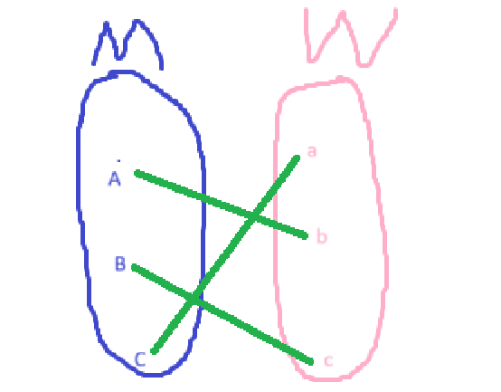

# Rewind of Big O notation
Big O notation is the Upper bound of a time used in doing some task

# Rewind of Proving
```
P -> Q
```

This means P implies Q. This is how you prove something.

Methods of proving: 
- Direct proving ```P -> Q```
- Indirect proving ```~Q -> ~P```
- Prove by contradiction 
```
Assume P is true
Assume Q is false
.
.
.
If a contradiction happens, it is impossible. Therefore, the statement is true.
```

# Stable Marriage Matching Problem
Given
```
M = set of n men/boys
W = set of n women/girls
```
Now we have to find a stable (perfect) matching from the inputs.

**Def** : matching **M** is a set of pairs (m,w)



**Def** (Unstable pair)
A pair (m,n) is matching **M** is unstable. iff

## Stable matching
Supposed that every men and women have a crush on each other. Stable matching is when everyone gets to marry their crushed ones or atleast, no one will run off with other person which is not their pair.

## Unstable matching
Imagine a scenario similar to the stable matching but not everyone gets to marry their crushes. Their might be a pair which they prefer each other more, but they were married to someone they despise. They would run off with each other.

## Gale-Shaploy Algorithm
Now, the question is how do we pair the men and women to a stable pair. This algorithm does exactly that.
```pseudo
M = {}
while |M| != n {
    m is a single/idle man
    w is the "currenrt" best girl.
    m proposes to w
    if w is single {
        w say yes
       M.push((m,w))
    } else {
        if w prefer x to m{
            w keeps the better guy
        }
        else{
            //w dumps the old guy and accept new one
            M.remove((x,w))
            M.add((m,w))
        }
    }
}
```

## Proof
Blah blah blah.

**Therefore** GS-Algorithm will always gives the best result.

## More about stable matching
[Stable Marriage Problem - Numberphile](https://www.youtube.com/watch?v=Qcv1IqHWAzg)

## Balls2Bin
**Claim** The running time of GS-Algorithm is $O(nlog(n))$.

**Idea** A proposed (m,w) = throw a ball into $i^{th}$ bin.

```number of proposals``` = ```number of balls``` needed to fill all n bins.