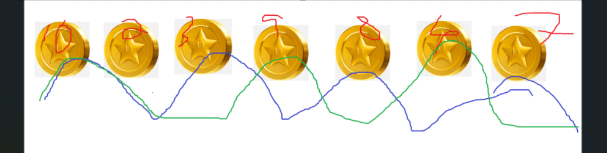

# Dynamic programming
The concept is we
1. Divide the problem into subproblems.
2. Solve the subproblems and store the results.
3. We use the results from the subproblem and use them to solve the bigger problem.

> Memorization - The concept of memorizing the previous solution.

## Fibonacci Number Problem Example
Consider a Fibonacci sequence, if you want to write a function to find them you can do as follow.

```cpp
int fibonacci(int num){
    if(num == 1){
        return 1;
    }
    else if(num == 2){
        return 1;
    }
    else {
        return fibonacci(n-1) + fibonacci(n-2);
    }
}
```

From this code, you can see that if we do this.
```cpp
for(int i = 0; i<1000; i++){
    std::cout << fibonacci(i) << std::endl;
}
```
It will take a really long time to run. It takes something like $O(1.6^n)$

The problem here lies on we're calling ```fibonacci()``` too many times. Now let's apply the dynamic programming to this. Let's add a way for the code to memorize the thing they already has calculate.

```cpp
// The writers of this code are Nattochan and myself.
std::vector<int> fibo_seq(100, -1); // Initialize a vector with 100 elements set to -1
int fibonacci(int num) {
    if (num <= 0) {
        throw std::invalid_argument("Number must be greater than 0");
    }
    if (fibo_seq[num] != -1) { // If the solution has already been computed, then return that.
        return fibo_seq[num];
    }
    if (num == 1 || num == 2) {
        return 1;
    }
    fibo_seq[num] = fibonacci(num - 1) + fibonacci(num - 2);
    return fibo_seq[num];
}
```
Now, the unnessary calculation has been cut off and now we are left with the greatly reduced runtime of $O(n)$.

> Hint: We can visualize the problem using a recursion tree.

> Protip: Nattochan is useless.

## Keys of dynamic programming
### Optimal Substructure
- To solve bigger problem, we need to solve smaller problem **optimally** first.
- We need to know how to reuse the answer of the smaller problems on the bigger problem.
### Overlapped Subproblems
- Solve small problems in order.

## Coin catcher example - step by step

The rules are intuitive heh heh heh.

1. Let's try playing it first.


2. Come up with subproblem
> Protip: Make the subproblems to be **easy**.

3. Now, let's use them. We have to add up the smaller thing to make up the bigger things.

**Define**: variable to keep the answer

Let x[i] be the maximum total reward from $a_1,a_2,a_3,...,a_i$

### Solution 3
- You are on the ground at the last step.

$Z(n)$ = $max(Z[n-1],Z[n-2]+a_{n-1})$


