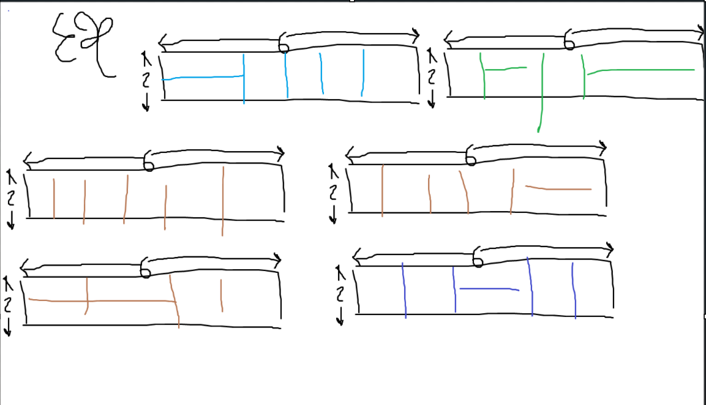

# Dynamic programming recap
- You break the problem into a lot of parts and then reuse the stuffs from the smaller problems to solve bigger problem.

# Matrix Chain Multiplication
Given ```n``` number of matrixes,
$A_1,A_2,A_3,...$ 

$A_1\times{A}_2\times{A}_3\times{A}_4\times...$

We want to compute this pile 

## First method - Divide (I have no idea what the hell is going on)
- Basically, by changing the order of calculation, it will reduce the running time.
$X=_{10}\times{A}_{100}B_5$

[Visualization](https://www.mimuw.edu.pl/~erykk/algovis/mcm.html)

More visualization


### Another easy example - Domino Packing (TM)
- There are n dimentons of size $2\times1$. How many ways to pack them into box of size $2\times{n}$
- 
- Let's play around an observe the pattern.
- 
- Observe that the $n=5$ is just reusing $n=4$ and $n=3$
- 

Let $D[i]$ ve the total number of ways to pack dominoes into box of size $2\times{n}$

- General case: 
$D[i]=D[i-1]+D[i-2]$
- Base case:
$D[1]=1,D[2]=2$
