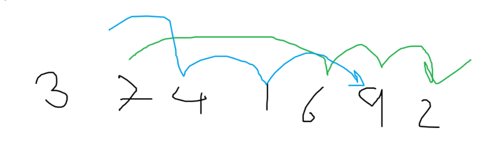

# Longest Increasing Subsequence
Given array A of n numbers

$A=a_1,a_2,a_3,...,a_n$

find the longest increasing subsequences. (The array is not sorted.)

- Example
- 

- More examples
```
Input: arr[] = {3, 10, 2, 1, 20}
Output: 3
Explanation: The longest increasing subsequence is 3, 10, 20

Input: arr[] = {30, 20, 10}
Output:1
Explanation: The longest increasing subsequences are {30}, {20} and (10)

Input: arr[] = {2, 2, 2}
Output: 1
Explanation: We consider only strictly increasing.

Input: arr[] = {10, 20, 35, 80}
Output: 4
Explanation: The whole array is sorted
```
## Play around first

## Sometime, the first try is not correct


## Solution
$L[i]=max(L[j]+1---if(a_{j-1}<a_i),)$