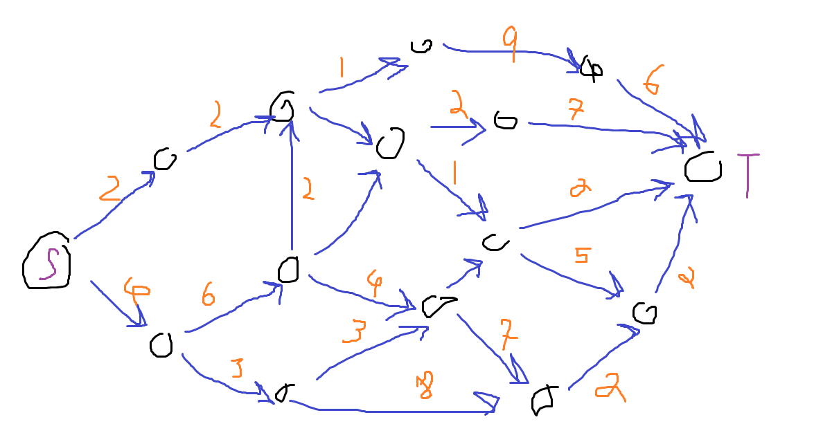
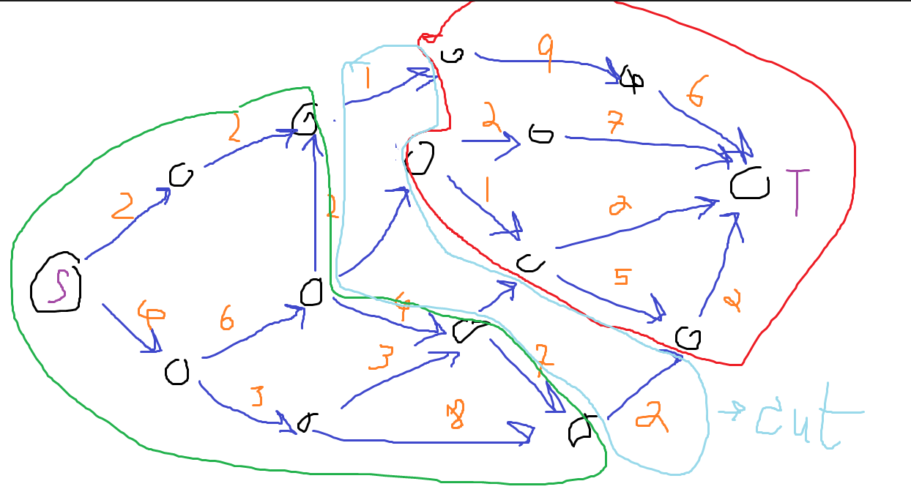
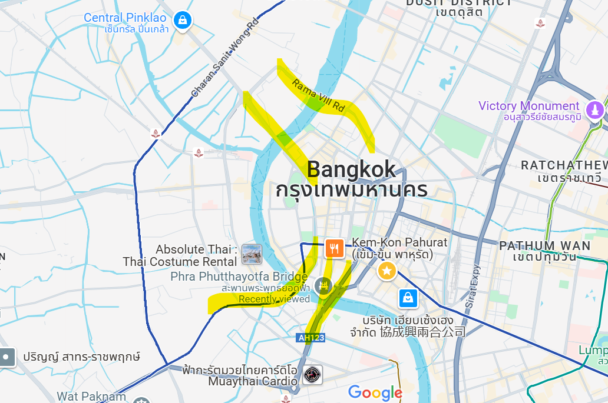
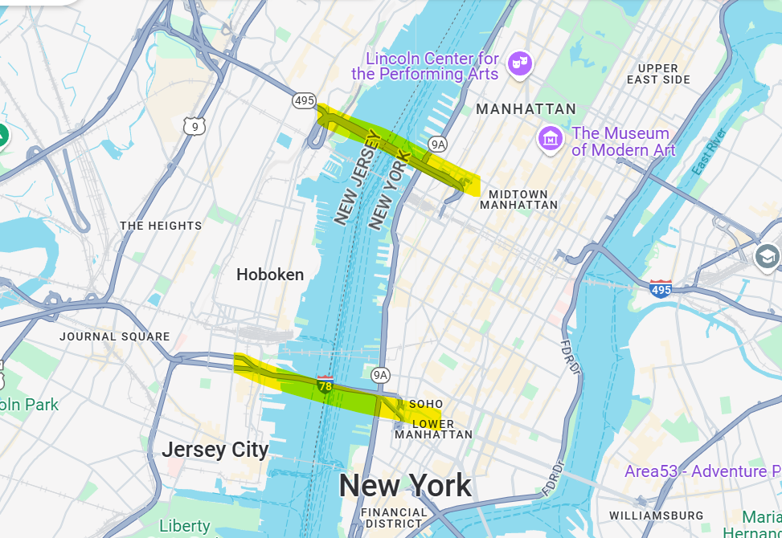

# Recap

- We use a genius method to calculate a fibonacci number using a matrix multiplication.

$A^n=\begin{bmatrix}
0 & 1\\
1 & 1
\end{bmatrix}=
\begin{bmatrix}
F_{n+1} & F_n\\
F_n & F_{n+1}
\end{bmatrix}$

## Knapsack problem
- stuffs

# Network flow
- We want to send something from place A to B as fast as possible. We care about bandwidth and flow, not about the distance.
- Given a directed graph $G=(V,E,W)$ and $c_e$ is the maximum capacity of edge $e$.
- We want to go from S to T. So, find the maximum flow from S to T.
- 
## What is flow?
    - Imagine the flow of water, a water flow is the amount of water traveling through a certain point per a segment of time.
### Flow properties
- flow is written as $f$. 
1. $\forall{e}\epsilon{E}$ $f_e\ge{c_e}$ - Flow cannot be less than any graph's load.
2. $\forall{v}\epsilon{E}$ $f_{v_{in}}=f_{v_{out}}$ - Flow must be preserve.
3. $f_{S_{out}}-f_{S_{in}}=f_{T_{in}}-f_{T_{out}}=max(f)$
## Remaining capacity
- 
## Cut
- 
- It is a set of edges that cut across two separated sides.
- Example - The only way for a car to get from the Thonburi to Phra Nakhorn side is by these bridges. These bridges are a bottle neck. (Only consider the ones provided in the screenshot)
- 
- Another example, to get from New Jersey to Manhattan, you only have 2 ways. These are the bottle neck. (Only consider the ones provided in the screenshot)
- 
- The maximum flow is equal to the minimum cut. $Max(Flow)\le{Cut(A,B)}$ $Max(Flow)\le{Min(Cut)}$
- There can be several cuts in the graph.

## Ford algorithm
```
Gf = G
While (s_t path, f, exists) {
    //Augment (send flow) on f
    F = F U P
    // Update Gf
    Remaining capacity C_u,v = C_u,v - f_u,v
    Virtual Capacity C_v,u = f_u,v
}
return F
```